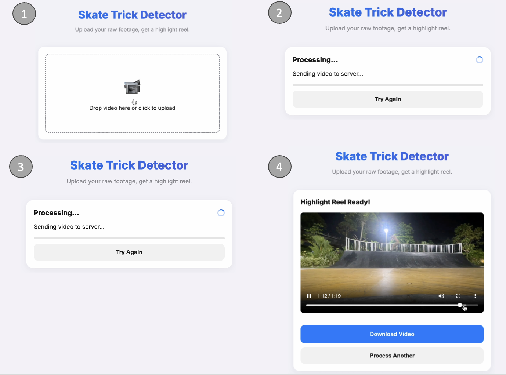

# Skate Trick Detector
Problem statement: Skaters often leave their phone in a location while filming themselves attempt tricks on an obstacles. After the session, they are left with large files with a large proportion of the clips being empty videos. Scrubbing through this video can be a tedious process. 
Thus, this simple web application that automatically detects when a skater enters and exits the frame in uploaded videos, extracts those segments, and creates a compiled highlight reel.



## Project structure

```
.
├─ src/                # FastAPI endpoints, Celery tasks, settings, job store
├─ static/             # Frontend HTML/CSS/JS
├─ uploads/            # Incoming files (per job)
├─ processing/         # Temp converted clips (per job)
├─ downloads/          # Final compiled highlights (per job)
├─ scripts/dev_up.sh   # One-shot launcher for Redis, Celery worker, FastAPI
├─ tests/              # Basic API flow tests
└─ assets/             # Docs assets (e.g., screenshots)
```


## How human detection works

- The app uses [MediaPipe Pose](https://developers.google.com/mediapipe/solutions/vision/pose_landmarker) via `mediapipe` to detect a person. Each frame is fed into the pose estimator, which returns pose landmarks when a human skeleton is visible.
- A human is considered present if pose landmarks are found; segments start only when the average pose landmark movement exceeds a threshold (`POSE_MOVEMENT_THRESHOLD`, default `0.02`) so minor fidgets are ignored.
- Close detections are merged if gaps are <1s, and a 2s buffer is added before plus a 3s buffer after each detected segment to avoid abrupt cuts when compiling the final reel.

## Prerequisites

- `uv` (Python package installer)
- FFmpeg `brew install ffmpeg` on macOS
- Redis (for Celery broker/result + job state) `brew install redis` then `redis-server`.


## Setup

1.  **Install dependencies:**

    ```bash
    uv venv .venv --python 3.11
    source .venv/bin/activate
    uv pip install -r requirements.txt
    ```

2.  **Run Redis** (if not already running):

    ```bash
    redis-server
    ```

3.  **Start all services together (Redis, Celery worker, FastAPI):**

    ```bash
    bash scripts/dev_up.sh
    ```

    This script activates `.venv`, starts a local Redis if one isn’t running, launches a Celery worker (default `--pool solo` to avoid fork issues on macOS), and runs uvicorn on port `8000`.

4.  **(Optional) Start individually instead of the script:**

    ```bash
    source .venv/bin/activate
    celery -A src.celery_app.celery_app worker -l info
    ```

5.  **Run the server (manual start; the script already does this):**

    ```bash
    source .venv/bin/activate
    uvicorn src.main:app --host 0.0.0.0 --port 8000
    ```

6.  **(Optional) Enable git hooks:**

    ```bash
    pip install pre-commit
    pre-commit install
    ```

## Usage

1.  Open your browser and navigate to `http://localhost:8000`.
2.  Upload one or more video files (e.g., `.mp4`, `.mov`); the server streams uploads so large files are fine.
3.  Wait for processing to complete. The app shows per-file progress; you can also poll `/api/status/{job_id}` if calling the API directly.
4.  Download each generated highlight reel from `/api/download/{job_id}/{file_id}` (the UI links these automatically). A backward-compatible `/api/download/{job_id}` returns the first completed file.

## Architecture

- **FastAPI** serves uploads, status, and download endpoints; uploads stream to disk to handle large files.
- **Celery + Redis** run per-file processing tasks concurrently; jobs are enqueued from the API and consumed by workers.
- **Redis job store** keeps batch/item status so progress survives API restarts and is visible to workers and clients.
- **MediaPipe + OpenCV + moviepy** handle moving-human detection, segment buffering, and highlight compilation to MP4.
- **Static frontend** provides drag/drop multi-upload UI, polls `/api/status/{job_id}`, and links per-file downloads.

### Environment variables

- `REDIS_URL` (default `redis://localhost:6379/0`)
- `PORT` (default `8000`)
- `CELERY_CONCURRENCY` (worker processes; default `2` in `scripts/dev_up.sh`)
- `CELERY_POOL` (Celery pool implementation; default `solo` for macOS stability)
- `UPLOAD_CHUNK_SIZE` (bytes per upload chunk; default `8MB`)
- `POSE_MOVEMENT_THRESHOLD` (minimum pose landmark motion to consider the person “moving”; default `0.02`)
- `POSE_TARGET_HEIGHT` (optional output height to downscale before detection; unset/0 to keep source)
- `POSE_TARGET_FPS` (optional output fps to downsample before detection; unset/0 to keep source)
